# About this repositoty

## Python Program Based on Telepath

This program works well in 16 bytes IV's AES-GCM mode,especially on TLS_ECDHE_RSA_WITH_AES_128_GCM_SHA256

Thanks a lot for isears's github program telepath:https://github.com/isears/telepath

Because I don't know much about the fork technology of github,I just write this repository to help those who want to decrypt tls session pcap with sslkeylogfile.

You are welcome to develop new programs based on this repository to support your Cipher Suite.

Most of the introduciton below is translated from Chinese by Google Translate.I am sorry some descriptions may confuse you. 

## Python Requirements

Python dependencies:

```bash
pip3 install pyshark pycryptodomex 
```

you can run parsePcap.py to test singlestream TCP TLS decryption

after that you can run hit_mail_decrypt.py to decrypt hit mail tls data with the help of ssl.log

## C++ Requirements

Please firstly install libnids,libpcap,cryptopp on your UNIX/Linux.

If you don't know how to install them,you can refer to #Install the C++ dependencies

then run the commands below to make the program 
```bash
$ g++ tom_mail_decrypt.cpp tls_decrypt.cpp utils.cpp -o tom_mail_decrypt -l nids -l pcap -l cryptopp --std=c++11
$ ./tom_mail_decrypt ./tom_pcap.pcap ./tom_ssl.log ./out_info.txt
```
after that you will get your output info in out_info.txt,just like the below photo

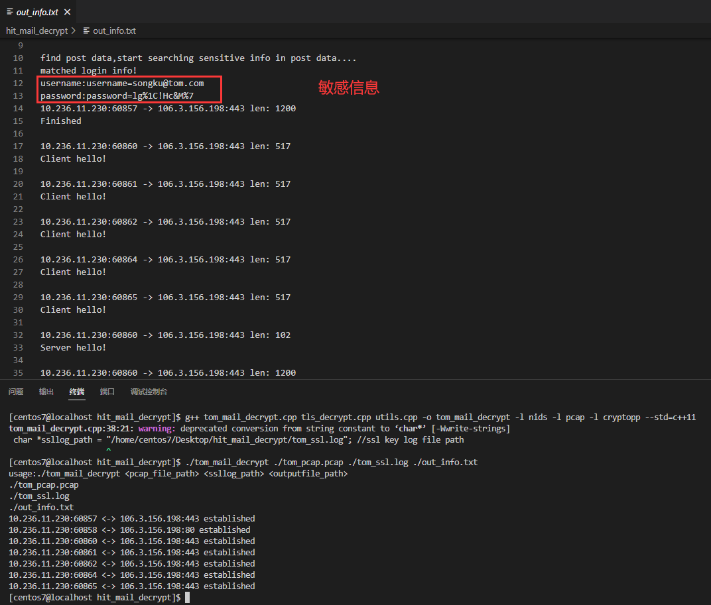

## TODO


## Structure of this reporitory

│  README.md
│  tree.txt
│  tree_old.txt
│  
├─Cplusplus_TLS  #cpp tls decryption
│      all_decoded_https.txt  # tom_mail.pcap's all decrypted http info
│      camellia_eax_mode.cpp  # an example to use cryptopp
│      out_info.txt  # outcome of ./tls_mail_decrypt
│      tls_decrypt.cpp  # tls decrypt cpp file
│      tls_decrypt.h
│      tom_mail.pcap
│      tom_mail_decrypt
│      tom_mail_decrypt.cpp  # main cpp file
│      tom_pcap.pcap
│      tom_ssl.log
│      utils.cpp  # utils cpp file
│      utils.h
│      
├─imgs
│      build_cryptest.png
│      build_success.png
│      get_and_install_libnids.png
│      install_bison.png
│      make_cryptopp_library.png
│      run_test_int.png
│      run_test_int_with_dynamic_link_library.png
│      search_cryptopp_on_centos_fail.png
│      solve_error.png
│      tom_mail_decrypt.png
│      tshark_error.png
│      verify_success.png
│      watch_libcryptopp_path.png
│      
└─Python_TLS
    │  CipherSuite.md  # CipherSuites's pattern
    │  debug_record.md  # ssl debug file's record
    │  hit_mail_decrypt.py
    │  introducution_of_TLS.md  # TLS session principle learn record
    │  KeyMaterial.py  # implement of KeyMaterial class
    │  MasterDecrypter.py  # implement of initial MasterDecrypter class
    │  parsePcap.py  # initial singlestream decryption script
    │  single_stream_example.py  # personal singlestream decryption script
    │  testMasterDecrypter.py  # just test MasterDecryper class
    │  
    ├─hit_mail
    │      hit_mail.pcap
    │      ssl.log
    │      ssldebug.log
    │      
    ├─singlestream_example
    │      singlestream.openmrs.org.pcap
    │      single_keylog.txt
    │      
    └─wireshark_example
            debug.txt
            dump.pcapng
            premaster.txt

# Install the C++ dependencies

My personal environment is centos7,some commands may be different between different UNIX/Linux machines.Therefore,this tutorial is just informative.

## 1. Install libpcap and libnids

### 1. Install libpcap

Install libpcap support environment

```bash
sudo yum install flex
sudo yum install bison
````


Download the libpcap installation package and unzip the installation

```bash
wget https://www.tcpdump.org/release/libpcap-1.10.1.tar.gz
tar -xf libpcap-1.10.1.tar.gz
cd libpcap-1.10.1
./configure
make
make install
````

### 2. Install libnids-1.24

```bash
wget https://nchc.dl.sourceforge.net/project/libnids/libnids/1.24/libnids-1.24.tar.gz #download libnids
tar -xf libnids-1.24.tar.gz #decompress
cd libnids-1.24 #Switch directory
./configure --disable-libglib --disable-libnet #Configure
make
sudo make install
````

The screenshot of some commands are as follows:

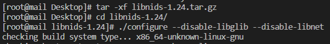

Note that when compiling and running the printall program, remember to add the link library reference: `-lnids -lpcap`

## 2. The use of crypto++ on linux

Reference: https://www.cryptopp.com/wiki/Linux

### 1. Download the library

There are two ways to get Crypto++ on a Linux machine. The first is to download Crypto++ from the website (or SourceForge/[SVN](https://www.cryptopp.com/wiki/SVN)). The second is to install Crypto++ from a package provided by a distribution such as Debian, Fedora, Mandrivia, OpenSuse or Ubuntu (see below [Linux distributions that provide Crypto++](https://www.cryptopp.com/wiki/Linux #Linux_Distributions_Offering_Crypto.2B.2B)).

Install on centos:

```bash
yum search crypto++
su
yum install cryptopp cryptopp-progs
````

However, the installation package does not exist in my own centos image.

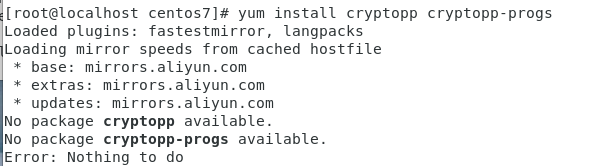

Finally download and unzip from sourceforge: https://sourceforge.net/projects/cryptopp/

```bash
wget https://sourceforge.net/projects/cryptopp/files/cryptopp/5.6.5/cryptopp565.zip
mkdir cryptopp
unzip -d cryptopp cryptopp565.zip # unzip the compressed file to a folder
cd cryptopp
````

### 2. Build and install the library

Crypto++ comes with a makefile called GNUMakefile and there is no `./configure` file. So use `make` to build static libraries and encryption programs.

Enter the following to build static archives, shared objects, and test programs.

```bash
make static dynamic cryptest.exe
````

The build process is shown in the following figure:

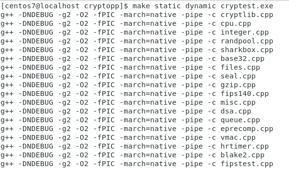

After the library is successfully built, run `./cryptest.exe v` and `./cryptest.exe tv all` to verify the library.

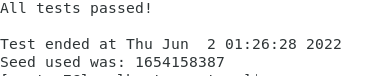

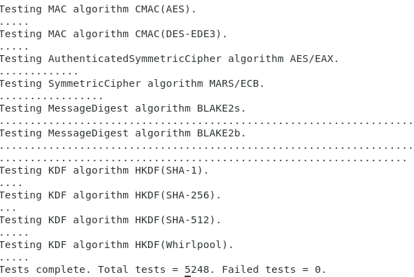

After verification, perform the final step to install the library. By default, Crypto++ installs to `/usr/local`, so install components as root.

```bash
sudo make install PREFIX=/usr/local
````

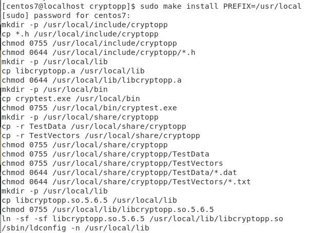

Use whereis to view, the dynamic link library is indeed installed in /usr/local

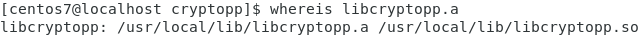

### 3. Compile and link, run the cryptopp test program

Create a test_int.cpp:

```bash
#include <iostream>
using std::cout;
using std::endl;

#include "cryptopp/integer.h"
using CryptoPP::Integer;

int main( int, char** ) {

  Integer j("10000000000000000000000000000000");
  j %= 1999;

  cout << "j: " << j << endl;

  return 0;
}
````

To compile and link the program, do the following. There are two things to be aware of when compiling and linking. First, use **g++** instead of gcc (see [Compiled C++ programs for GCC](http://gcc.gnu.org/onlinedocs/gcc/Invoking-G_002b_002b.html)). Second, the library directive (`-l`) is the last argument to g++. Note: On some systems (e.g. Fedora) the library option may be `-lcrypto++`.

```bash
g++ -DNDEBUG -g3 -O2 -Wall -Wextra -o test_int test_int.cpp -l:libcryptopp.a
````

`-Wall` and `-Wextra` turn on most warnings, because it's always a good idea to let static analysis tools catch bugs early.

The `-g3` switch adds maximum debug information to executable tests and is not required (note that -g is equivalent to -g2).

`-O0` disables all optimizations, note that `-O0` is the default optimization level.

`-o` specifies the output filename. `-l` specifies the library.

Execute the test program and see the effect: `./test_0602`

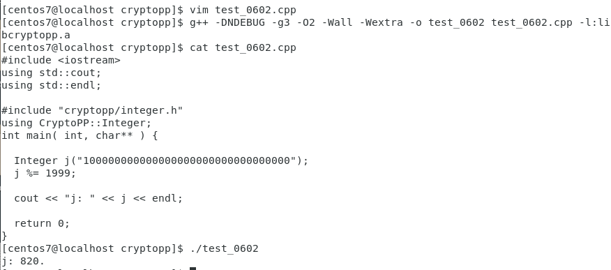

It is actually also possible to compile the file using the dynamic library, in which case there is no need to save the .a file.

But you need to add the cryptopp library directory to the environment variable.

The directory where libcryptopp.so is located is `/usr/local/lib`. Add this directory to the configuration file of the shared library

```bash
echo "/usr/local/lib" >> /etc/ld.so.conf
ldconfig
````

Then use the dynamic library to compile and run, the effect is shown in the following figure, and the j:820 is successfully output:

```bash
g++ -DNDEBUG -g3 -O2 -Wall -Wextra -o test_int test_int.cpp -lcryptopp
./test_int
````

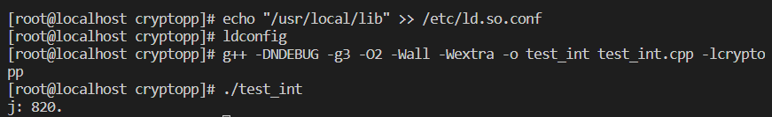

# Possible runtime bugs

## 1.Wireshark program path error

if you run this program with some error which points out:pyshark.tshark.tshark.TSharkNotFoundException: TShark not found.

just like the img below:
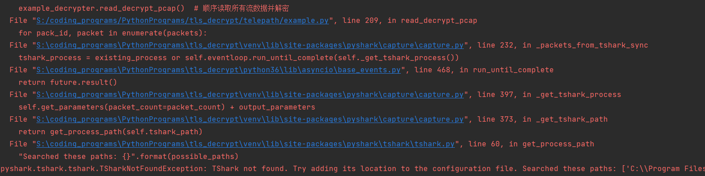
It means your wireshark.exe can't be found to support pyshark.

You'd better go to the lib file and modify the searching path just like below photo to math your real wireshark path with the path in tshark.py.

Shown in this photo,my Wireshark program was installed in S:\Sec_Tools\Wireshark,and I modified the program_files variable in tshark.py to make sure the tshark.py can find my wireshark.exe
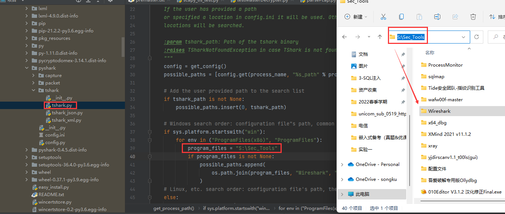